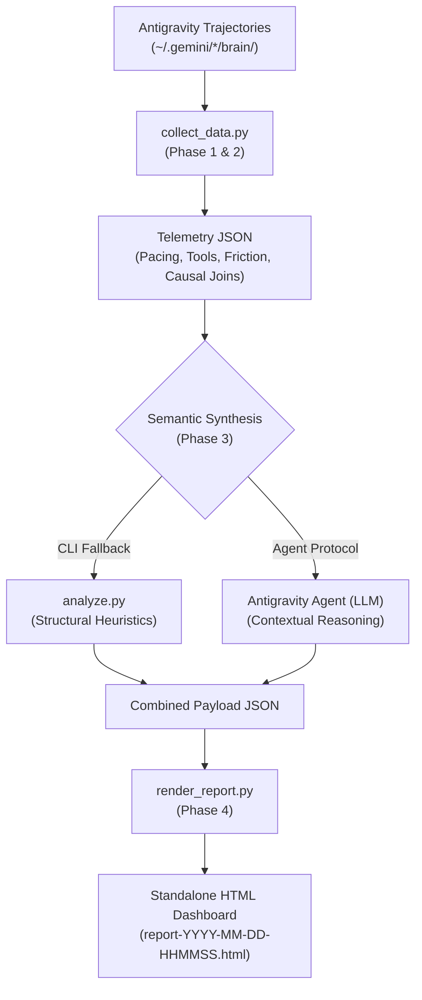

# insights-antigravity

`insights-antigravity` is a behavioral usage telemetry and analytics skill for Google Antigravity, inspired by `/insights` in Claude Code.

It analyzes multi-surface Antigravity conversation trajectories across both the IDE and Desktop runtimes (`~/.gemini/antigravity-ide/brain/` and `~/.gemini/antigravity/brain/`) to extract quantitative telemetry and compile a standalone, interactive HTML dashboard.

---

## Overview

The skill operates as a four-phase hybrid pipeline:
1. **Quantitative Telemetry Extraction (`scripts/collect_data.py`)**: Traverses conversation logs (`transcript.jsonl`), applies a turn-boundary latency state machine, detects subagent delegations, computes percentile distributions (p50/p75/p90/p99), aggregates tool usage frequencies, and performs causal joins between tool errors and subsequent user corrections.
2. **Behavioral & Workflow Analysis**: Identifies execution patterns (explore $\to$ plan $\to$ edit $\to$ verify), rework churn across files, loop detection, and session-level satisfaction metrics.
3. **Semantic Synthesis (`scripts/analyze.py` / Agent LLM Protocol)**: Clusters prompts and milestones into project areas, extracts high-complexity session trajectories, categorizes friction points with concrete log excerpts, and formulates evidence-based workflow recommendations.
4. **Interactive HTML Compilation (`scripts/render_report.py`)**: Compiles telemetry and semantic facets into a self-contained, responsive HTML report with client-side project drilldowns and visual breakdown charts.

---

## Key Features & Telemetry Dimensions

### 1. Pacing & Response Time Analytics
- **User Dwell / Think Time**: Measures elapsed time between an agent turn completion and the subsequent user prompt at turn boundaries (capped at 4 hours to filter away-time). Calculates p50, p75, p90, and p99 distributions.
- **Model Latency**: Measures generation and tool execution duration per model turn.

### 2. Agent Skill & Slash Command Usage
- **Autonomy Split**: Classifies skill invocations into agent-autonomous reads (e.g., loading `SKILL.md` via `view_file`) vs. explicit user slash commands (e.g., `/test-driven-development`).
- **Session Penetration**: Computes the percentage of unique sessions that utilized each skill.
- **Top 4 Skill Cards**: Displays skill ranking, total uses, project distribution, and autonomy ratios.

### 3. Workflow Topology & Funnel
- **Phase Transitions**: Tracks progression along `explore -> plan -> edit -> verify -> revisit` chains.
- **Loop & Churn Detection**: Identifies repeated tool calls with identical arguments (stuck loops), edit-test-fix cycles, and rapid user interruptions.
- **File Churn Tracking**: Surfaces multi-session rework hotspots across files and days.

### 4. Causal Friction & Satisfaction Scorecards
- **Causal Joins**: Links user corrective prompts back to preceding tool execution failures within a 10-minute sliding window.
- **Friction Classification**: Categorizes errors into permission/boundary rejections, missing paths, syntax/lint errors, tool timeouts, and command execution failures.
- **Satisfaction Metrics**: Computes friction-free session percentage, implementation plan-to-walkthrough completion rates, and proactive vs. reactive steering distributions.

### 5. Multi-Surface Continuity
- **Dual Surface Tracking**: Collects and correlates telemetry across both Antigravity IDE (`~/.gemini/antigravity-ide/`) and Antigravity Desktop (`~/.gemini/antigravity/`).
- **Surface Breakdown**: Displays session counts, tool calls, and shared workspace trajectories per surface.

---

## Architecture & Data Flow



---

## Dependencies & Requirements

- **Python**: Python 3.9+ standard library only (`json`, `argparse`, `datetime`, `collections`, `pathlib`, `re`, `html`, `difflib`).
- **Zero Third-Party Dependencies**: No external pip packages required.
- **Runtime Environment**: Compatible with macOS and Linux environments running Google Antigravity.

---

## Installation

Choose one of the three installation methods below depending on how you wish to manage `insights-antigravity`.

### Method 1: Install via Antigravity Plugin CLI (Fastest & Recommended)

You can install the plugin directly from GitHub using `agy plugin install`:

```bash
# 1-command installation directly from GitHub
agy plugin install https://github.com/Goldwaterfung/insights-antigravity.git
```

*(Alternatively, install from a local clone)*:
```bash
git clone https://github.com/Goldwaterfung/insights-antigravity.git
cd insights-antigravity
agy plugin install .
```

**Verify the installation:**
```bash
agy plugin list
```
You should see `insights-antigravity` listed under active plugins.

**Manage plugin lifecycle:**
```bash
agy plugin disable insights-antigravity   # Suspend plugin without deleting
agy plugin enable insights-antigravity    # Re-enable suspended plugin
agy plugin uninstall insights-antigravity # Remove plugin bundle
```

---

### Method 2: Install as a Global Agent Skill (Machine-Wide)

If you want `insights-antigravity` available across every repository and workspace on your workstation without managing it as a plugin:

**Step 1: Clone directly into your global Antigravity skills directory**
```bash
# For Antigravity CLI global skills:
git clone https://github.com/Goldwaterfung/insights-antigravity.git ~/.gemini/antigravity-cli/skills/insights-antigravity

# Or for standard Antigravity global configuration:
git clone https://github.com/Goldwaterfung/insights-antigravity.git ~/.gemini/config/skills/insights-antigravity
```

**Step 2: Verify discovery**
Launch `agy` or open Antigravity. The skill is automatically loaded and `/insights-antigravity` becomes accessible in the prompt interface.

---

### Method 3: Install as a Workspace Skill (Project-Specific)

To check the skill directly into a specific project codebase so that everyone on your team shares it:

**Step 1: Navigate to your project root**
```bash
cd /path/to/your-project
```

**Step 2: Create the workspace skills folder and clone**
```bash
mkdir -p .agents/skills
git clone https://github.com/Goldwaterfung/insights-antigravity.git .agents/skills/insights-antigravity
```

**Step 3: Commit to version control**
```bash
git add .agents/skills/insights-antigravity
git commit -m "chore: add insights-antigravity workspace skill"
```

---

## Usage

### Method A: Invocation via Antigravity Chat (Recommended)

When working inside Antigravity, trigger the skill naturally in conversation:

- *"Analyze my Antigravity usage"*
- *"Show my usage insights for the last 14 days"*
- *"What are my biggest friction points in project `<name>`?"*

The agent executes the four-step protocol defined in `SKILL.md`:
1. Extract telemetry via `collect_data.py`.
2. Perform qualitative synthesis over representative session trajectories.
3. Compile the combined payload into the HTML report via `render_report.py`.
4. Output a link to the generated report with an executive summary.

### Method B: Standalone CLI Execution

You can run the analysis pipeline directly from your terminal:

```bash
# End-to-end report generation (defaults to all sessions across all surfaces)
python3 scripts/analyze.py

# Filter by time window (e.g., past 7 or 30 days)
python3 scripts/analyze.py --days 14

# Filter by project keyword
python3 scripts/analyze.py --project my-project

# Filter by runtime surface
python3 scripts/analyze.py --surface ide      # or 'desktop', 'all'

# Output raw telemetry JSON to stdout
python3 scripts/analyze.py --json

# Render report from a custom LLM semantic insights JSON payload
python3 scripts/analyze.py --insights-file /path/to/semantic_insights.json
```

### Method C: Modular Execution

```bash
# Step 1: Collect quantitative telemetry
python3 scripts/collect_data.py --output /tmp/telemetry.json --days 30

# Step 2: Render HTML dashboard from telemetry payload
python3 scripts/render_report.py --input /tmp/telemetry.json
```

Generated HTML reports are written to:
- `~/.gemini/antigravity-ide/usage-data/report-YYYY-MM-DD-HHMMSS.html`
- `~/.gemini/antigravity/usage-data/report-YYYY-MM-DD-HHMMSS.html`

---

## Project Structure

```
insights-antigravity/
├── plugin.json              # Antigravity CLI plugin package manifest
├── SKILL.md                 # Antigravity skill definition and agent protocol
├── README.md                # Project documentation and usage guide
├── LICENSE                  # MIT License
├── references/
│   └── schema.json          # JSON schema definition for semantic insights payload
└── scripts/
    ├── collect_data.py      # Telemetry extraction, state machine & friction analysis
    ├── analyze.py           # CLI driver and structural semantic clustering
    └── render_report.py     # Standalone HTML report compiler
```

---

## Telemetry Schema & Configuration

The semantic insights payload adheres to the JSON schema defined in [`references/schema.json`](references/schema.json). 

Custom taxonomy rules (such as additional locale patterns for user correction matching or tool error markers) can be extended in `scripts/collect_data.py` under the `CONFIG` section.

---

## License

This project is licensed under the [MIT License](LICENSE).
